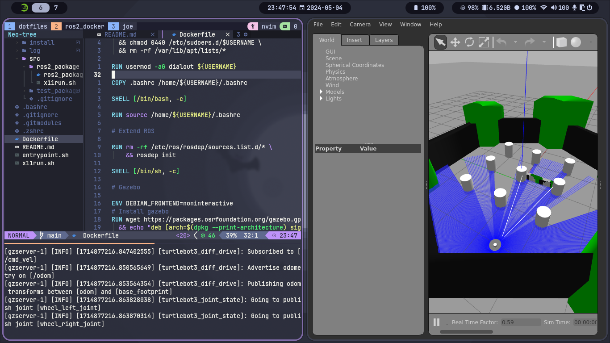

# ROS 2 Docker

My workflow to run ros2 applications inside Docker, including base stage to deploy applications and develop stage with mypersonal configuration.

## Preview

Preview of the [Docker](https://www.docker.com/) image provided by this package simulating the [Turtlebot3 waffle](https://github.com/ROBOTIS-GIT/turtlebot3) with [Gazebo](https://gazebosim.org). Inside the container, the following instructions were executed

```bash
sudo apt install ros-humble-turtlebot3 ros-humble-turtlebot3-simulations
export TURTLEBOT3_MODEL=waffle
export GAZEBO_MODEL_PATH=$GAZEBO_MODEL_PATH:/opt/ros/$ROS_DISTRO/share/turtlebot3_gazebo/models
. ~/.zshrc # or .bashrc if the ros2_docker:base image is being used
ros2 launch turtlebot3_gazebo turtlebot3_world.launch
```

and this is the result:



## Install

Clone the repository

```bash
git clone --recursive git@github.com:joefscholtz/ros2_docker.git
```

## Prerequisites

- Docker
- Docker Compose
- just (Optional)

## Build

Build image

```bash
docker compose -f docker-compose.local.yml build;
# Alternatively, using just
just build-image

```

## Run

Start container

```bash
docker compose -f docker-compose.local.yml run -it --rm --name ros2_docker ros2_docker_app zsh
# Alternatively, using just
```


## Special thanks

- [Allison Thackston](https://github.com/athackst) for her [dockerfiles repo](https://github.com/athackst);
- [Josh Newans from Articulated Robotics](https://www.youtube.com/@ArticulatedRobotics)
